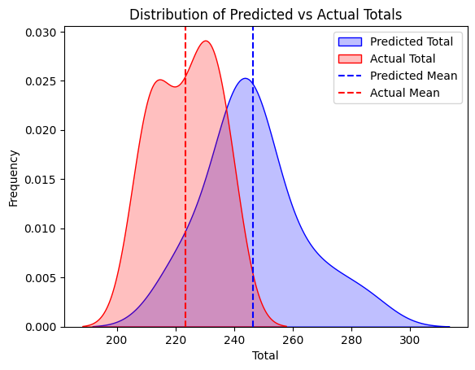

# PLONN - NBA Total Points Predictions

This repository contains a script for predicting total points in NBA games using a simple MLP, with a unique feature vector-setup.
Feel free to join the free discord 
[PLONN Discord](https://discord.gg/UJRrNcscUE)

## 📄 Script Overview

- **Filename**: `nba_total_pts.py`
- **Models**: There are 3 models available Raw, Advanced (adv), and 30-day Window (30dw) all predicting a team total score when matched up against another NBA team.

## Models

- After about 30 days of raw predictions we decided to take a look at the distribtion between the Total Actual scores vs. the Total Predicted scores. Using the distribution leads to a 5% increase in accuracy after 30 days. After the 30-day window we will need to refesh the distribution data to prevent irrelevance.




## 🚀 Features
- Loads and processes NBA game data
- Trains MLP model for total team points points prediction
- Implements feature engineering and data cleaning
- Supports model evaluation and predictions such as the distribution
- **The raw model takes in 11 basic NBA features**: ['PTS', 'FG%', 'FGA', '3P%', '3PA', 'ORB', 'TRB','AST', 'TOV', 'STL', 'PF']
- **The Adv/30dw models have 15 Features**: ['PTS', 'FG%', 'FGA', '3P%', '3PA', 'ORB', 'TRB', 'AST', 'TOV', 'STL', 'PF', 'ORtg', 'DRtg', 'FTA', 'FT%']

The scatter plot shows how close the advance model is predicting previous games (train data). At the end of training we can expect mae to be > 0.5 due to important features such as offensive and defensive rating.


## 🛠 Requirements
Ensure you have the following Python libraries installed:
```bash
pip3 install pandas numpy scikit-learn tensorflow
```

## ▶️ Usage
Run the script using the raw model with:
```bash
python3 nba_total_pts.py -t -g -m raw
```

## 📌 Notes
- Modify the script to include additional data sources if needed.
- Check model accuracy and tweak parameters for better predictions.

---

🔗 **Author**: Jake Giguere   
📅 **Last Updated**: 02/19/2025
**Reference**: [Basketball Reference](https://stathead.com/basketball/)